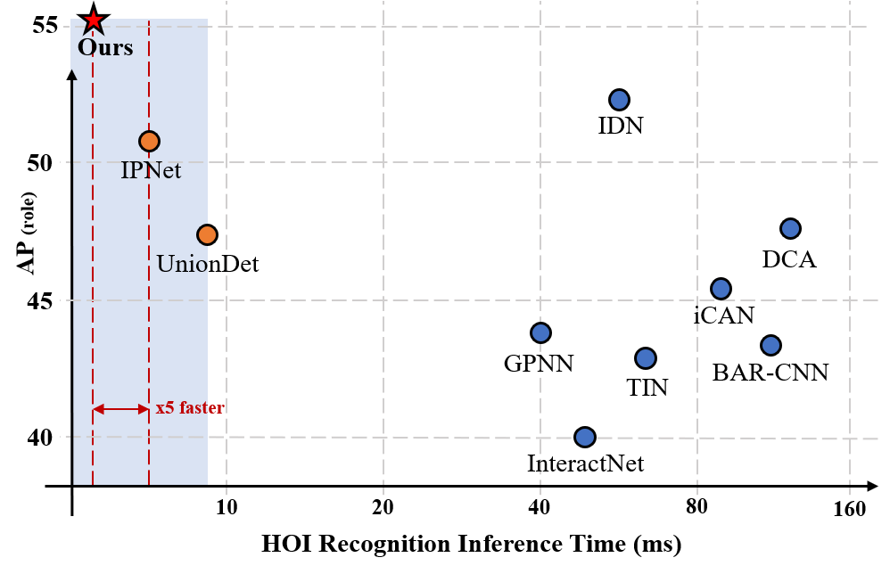
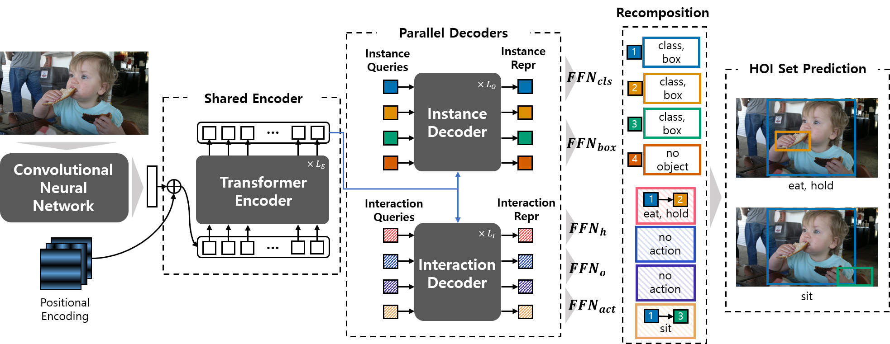

<p align="center"></p>

-------------------------------------------------------------------------------------

Official PyTorch Implementation for [HOTR: End-to-End Human-Object Interaction Detection with Transformers](http://arxiv.org/abs/2104.13682) (CVPR'2021, Oral Presentation)

# HOTR: End-to-End Human-Object Interaction Detection with Transformers
HOTR is a novel framework which directly predicts a set of {human, object, interaction} triplets from an image using a transformer-based encoder-decoder.
Through the set-level prediction, our method effectively exploits the inherent semantic relationships in an image and does not require time-consuming post-processing which is the main bottleneck of existing methods.
Our proposed algorithm achieves the state-of-the-art performance in two HOI detection benchmarks with an inference time under 1 ms after object detection.
<p align="center"></p>

HOTR is composed of three main components: a shared encoder with a CNN backbone, a parallel decoder, and the recomposition layer to generate final HOI triplets.
The overview of our pipeline is presented below.

<p align="center"></p>


## 1. Environmental Setup
```bash
$ conda create -n kakaobrain python=3.7
$ conda install -c pytorch pytorch torchvision # PyTorch 1.7.1, torchvision 0.8.2, CUDA=11.0
$ conda install cython scipy
$ pip install pycocotools
$ pip install opencv-python
$ pip install wandb
```

## 2. HOI dataset setup
Our current version of HOTR supports the experiments for both [V-COCO](https://github.com/s-gupta/v-coco) and [HICO-DET](https://drive.google.com/file/d/1QZcJmGVlF9f4h-XLWe9Gkmnmj2z1gSnk/view) dataset.
Download the dataset under the pulled directory.
For HICO-DET, we use the [annotation files](https://drive.google.com/file/d/1QZcJmGVlF9f4h-XLWe9Gkmnmj2z1gSnk/view) provided by the PPDM authors.
Below we present how you should place the files.
```bash
# V-COCO setup
$ git clone https://github.com/s-gupta/v-coco.git
$ cd v-coco
$ ln -s [:COCO_DIR] coco/images # COCO_DIR contains images of train2014 & val2014
$ python script_pick_annotations.py [:COCO_DIR]/annotations

# HICO-DET setup
$ tar -zxvf hico_20160224_det.tar.gz # move the unballed folder under the pulled repository

# dataset setup
HOTR
 │─ v-coco
 │   │─ data
 │   │   │─ instances_vcoco_all_2014.json
 │   │   :
 │   └─ coco
 │       │─ images
 │       │   │─ train2014
 │       │   │   │─ COCO_train2014_000000000009.jpg
 │       │   │   :
 │       │   └─ val2014
 │       │       │─ COCO_val2014_000000000042.jpg
 :       :       :
 │─ hico_20160224_det
 │       │─ annotations
 │       │   │─ trainval_hico.json
 │       │   │─ test_hico.json
 │       │   └─ corre_hico.npy
 :       :
```

If you wish to download the datasets on our own directory, simply change the 'data_path' argument to the directory you have downloaded the datasets.
```bash
--data_path [:your_own_directory]/[v-coco/hico_20160224_det]
```

## 3. How to Train/Test HOTR
For both training and testing, you can either run on a single GPU or multiple GPUs.
```bash
# single-gpu training / testing
$ make [vcoco/hico]_single_[train/test]

# multi-gpu training / testing (8 GPUs)
$ make [vcoco/hico]_multi_[train/test]
```

For testing, you can either use your own trained weights and pass the group name and run name to the 'resume' argument, or use our provided weights.
Below is the example of how you should edit the Makefile.
```bash
# [Makefile]
# Testing your own trained weights
[vcoco/hico]_multi_test:
  python -m torch.distributed.launch \
		--nproc_per_node=8 \
    ...
    --resume checkpoints/[vcoco/hico_det]/[:group_name]/[:run_name]/best.pth # the best performing checkpoint is saved in this format

# Testing our provided trained weights
[vcoco/hico]_multi_test:
  python -m torch.distributed.launch \
		--nproc_per_node=8 \
    ...
    --resume checkpoints/[vcoco/hico_det]/[vcoco/hico]_q16.pth # download the q16.pth as described below.
```
In order to use our provided weights, you can download the weights provided below.
Then, pass the directory of the downloaded file (for example, to test our pre-trained weights on the vcoco dataset, we put the downloaded weights under the directory checkpoints/vcoco/vcoco_q16.pth) to the 'resume' argument.

## 4. Results
Here, we provide improved results of V-COCO Scenario 1 (58.9 mAP, 0.5ms) and HICO-DET Default(Full) (23.76 mAP) from the version of our initial submission (55.2 mAP & 23.46 mAP, 0.9ms).
This is obtained "without" applying any priors on the scores (see [iCAN](https://github.com/vt-vl-lab/iCAN/blob/83a363cfc80bf62538d5faf6ec17c871686c0635/lib/ult/apply_prior.py)).

### 4-1. V-COCO dataset
| Epoch | # queries | Scenario 1   | Scenario 2  | Checkpoint   |
|:-----:|:---------:|:------------:|:-----------:|:------------:|
|  100  |     16    |     58.9     |     63.8    | [download](https://arena.kakaocdn.net/brainrepo/hotr/vcoco_q16.pth)  |

### 4-2. HICO-DET dataset
| Epoch | # queries |  Default(Full)  |  Rare  | Non-Rare | Checkpoint   |
|:-----:|:---------:|:---------------:|:------:|:--------:|:------------:|
|  100  |     16    |      23.76      |  22.34 |   24.19  | [download](https://arena.kakaocdn.net/brainrepo/hotr/hico_q16.pth)  |

If you want to use pretrained weights for inference, download the pretrained weights (from the above link) under `checkpoints/vcoco/` or `checkpoints/hico-det/` and match the interaction query argument as described in the weight file (others are already set in the Makefile).
Our evaluation code follows the exact implementations of the official python evaluation.
You can test the weights by the command below (e.g., the weight file is named as [vcoco/hico]_q16.pth, which denotes that the model uses 16 interaction queries).

```bash
# Inference for V-COCO (8 GPUs)
python -m torch.distributed.launch \
    --nproc_per_node=8 \
    --use_env vcoco_main.py \
    --batch_size 2 \
    --HOIDet \
    --share_enc \
    --pretrained_dec \
    --num_hoi_queries [:query_num] \
    --temperature 0.05 \ # use the exact same temperature value that you used during training!
    --object_threshold 0 \
    --no_aux_loss \
    --eval \
    --dataset_file vcoco \
    --data_path v-coco \
    --resume checkpoints/vcoco/vcoco_[:query_num].pth

# Inference for HICO-DET (8 GPUs)
python -m torch.distributed.launch \
    --nproc_per_node=8 \
    --use_env main.py \
    --batch_size 2 \
    --HOIDet \
    --share_enc \
    --pretrained_dec \
    --num_hoi_queries [:query_num] \
    --object_threshold 0 \
    --temperature 0.2 \ # use the exact same temperature value that you used during training!
    --no_aux_loss \
    --eval \
    --dataset_file hico-det \
    --data_path hico_20160224_det \
    --resume checkpoints/hico_det/hico_[:query_num].pth
```

The results will appear as the following:
```bash
# V-COCO
[Logger] Number of params:  51181950
Evaluation Inference (V-COCO)  [308/308]  eta: 0:00:00    time: 0.2063  data: 0.0127  max mem: 1578
[stats] Total Time (test) : 0:01:05 (0.2114 s / it)
[stats] HOI Recognition Time (avg) : 0.5221 ms
[stats] Distributed Gathering Time : 0:00:49
[stats] Score Matrix Generation completed

============= AP (Role scenario_1) ==============
               hold_obj: AP = 48.99 (#pos = 3608)
              sit_instr: AP = 47.81 (#pos = 1916)
             ride_instr: AP = 67.04 (#pos = 556)
               look_obj: AP = 40.57 (#pos = 3347)
              hit_instr: AP = 76.42 (#pos = 349)
                hit_obj: AP = 71.27 (#pos = 349)
                eat_obj: AP = 55.75 (#pos = 521)
              eat_instr: AP = 67.57 (#pos = 521)
             jump_instr: AP = 71.44 (#pos = 635)
              lay_instr: AP = 57.09 (#pos = 387)
    talk_on_phone_instr: AP = 49.07 (#pos = 285)
              carry_obj: AP = 34.75 (#pos = 472)
              throw_obj: AP = 52.37 (#pos = 244)
              catch_obj: AP = 48.80 (#pos = 246)
              cut_instr: AP = 49.58 (#pos = 269)
                cut_obj: AP = 57.02 (#pos = 269)
 work_on_computer_instr: AP = 67.44 (#pos = 410)
              ski_instr: AP = 49.35 (#pos = 424)
             surf_instr: AP = 77.07 (#pos = 486)
       skateboard_instr: AP = 86.44 (#pos = 417)
            drink_instr: AP = 38.67 (#pos = 82)
               kick_obj: AP = 73.92 (#pos = 180)
               read_obj: AP = 44.81 (#pos = 111)
        snowboard_instr: AP = 81.25 (#pos = 277)
│ mAP(role scenario_1): 58.94
----------------------------------------------------

# HICO-DET
[Logger] Number of params:  51204566
Evaluation Inference (HICO-DET)  [597/597]  eta: 0:00:00    time: 0.2099  data: 0.0109  max mem: 1272
[stats] Total Time (test) : 0:02:07 (0.2140 s / it)
[stats] HOI Recognition Time (avg) : 0.9025 ms
[stats] Score Matrix Generation completed
│ mAP (full)            : 23.76
│ mAP (rare)            : 22.34
│ mAP (non-rare)        : 24.19
```
The HOI recognition time is calculated by the end-to-end inference time excluding the object detection time.

## 5. Auxiliary Loss
HOTR follows the auxiliary loss of DETR, where the loss between the ground truth and each output of the decoder layer is also computed.
The ground-truth for the auxiliary outputs are matched with the ground-truth HOI triplets with our proposed Hungarian Matcher.

## 6. Temperature Hyperparameter, tau
Based on our experimental results, the temperature hyperparameter is sensitive to the number of interaction queries and the coefficient for the index loss and index cost, and the number of decoder layers.
Empirically, a larger number of queries require a larger tau, and a smaller coefficient for the loss and cost for HO Pointers requires a smaller tau (e.g., for 16 interaction queries, tau=0.05 for the default set_cost_idx=10, hoi_idx_loss_coef=1, hoi_act_loss_coef=10 shows the best result for V-COCO and tau=0.2, set_cost_idx=20 shows the best result for HICO-DET).
There might be better results than the tau we used in our paper according to these three factors.
Feel free to explore yourself!

## 7. Citation
If you find this code helpful for your research, please cite our paper.
```bash
@inproceedings{kim2021hotr,
  title={HOTR: End-to-End Human-Object Interaction Detection with Transformers},
  author    = {Bumsoo Kim and
               Junhyun Lee and
               Jaewoo Kang and
               Eun-Sol Kim and
               Hyunwoo J. Kim},
  booktitle = {CVPR},
  publisher = {IEEE},
  year      = {2021}
}
```

## 8. Contact for Issues
Bumsoo Kim, [bumsoo.brain@kakaobrain.com](bumsoo.brain@kakaobrain.com)

## 9. License
This project is licensed under the terms of the Apache License 2.0.
Copyright 2021 Kakao Brain Corp. [https://www.kakaobrain.com](https://www.kakaobrain.com) All Rights Reserved.
